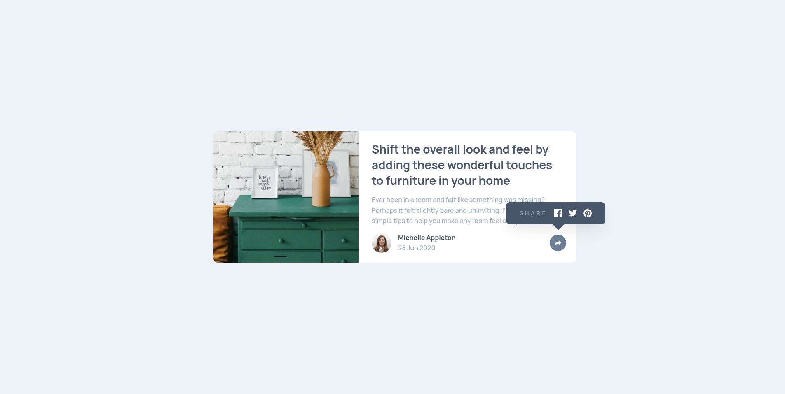

# Frontend Mentor - Article preview component solution

Это решение задачи [Article preview component challenge на Frontend Mentor](https://www.frontendmentor.io/challenges/article-preview-component-dYBN_pYFT).  
Задача помогает улучшить навыки вёрстки и программирования, создавая реалистичный компонент.

## Обзор

### Задача

Пользователи должны иметь возможность:

- Видеть оптимальную вёрстку компонента в зависимости от размера экрана своего устройства
- Видеть попап с ссылками на социальные сети при клике на иконку "Поделиться"

### Скриншот



### Ссылки

- [Репозиторий решения](https://github.com/async-kita/article-preview-component)
- [Живой сайт](https://async-kita.github.io/article-preview-component/)

## Моя работа

### Использованные технологии

- **Семантическая HTML5-разметка**
- **CSS Flexbox и Grid** – для построения карточки и попапа
- **Mobile-first подход** – медиазапрос для мобильных устройств
- **CSS-переменные** – для цветов, теней, типографики
- **JavaScript (ES6)** – управление открытием/закрытием попапа и ARIA-атрибутами
- **Адаптивные изображения** – `object-fit` и `object-position`

### Что я узнал в этом проекте

- Как разместить попап со стрелкой поверх карточки (absolute + relative + псевдоэлемент) для десктопной версии и полностью перестроить его для мобильной версии.
- Как управлять состоянием кнопки (active) и доступностью через `aria-expanded`.
- Трансформации (scale, opacity) для плавного появления/исчезновения попапа.
- Адаптация сетки: переход с двухколоночного макета на одноколоночный при `max-width: 1024px`.

Пример кода, которым я горжусь:

```css
const onClickButton = () => {
  if (shareElement.classList.contains("is-active")) {
    shareElement.classList.remove("is-active");
    buttonElement.setAttribute("aria-expanded", "false");
  } else {
    shareElement.classList.add("is-active");
    buttonElement.setAttribute("aria-expanded", "true");
  }
};
```
